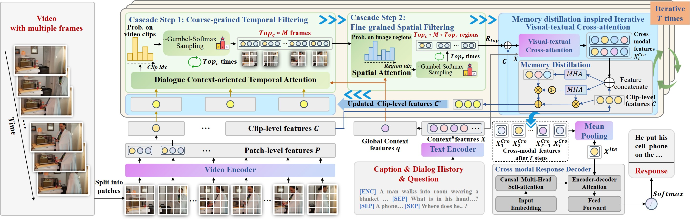
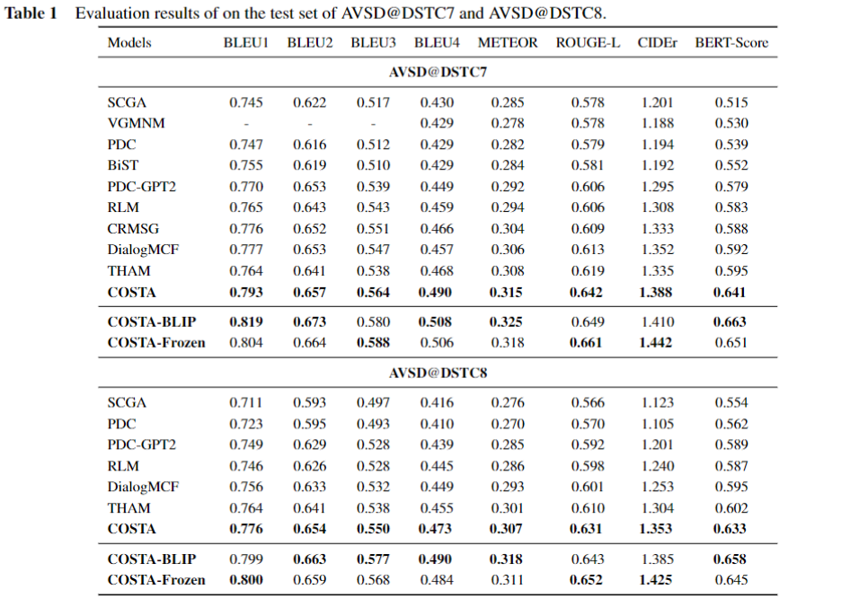
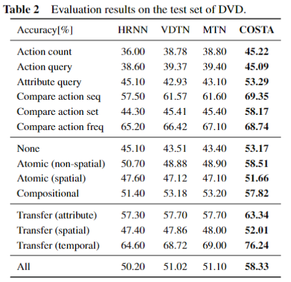
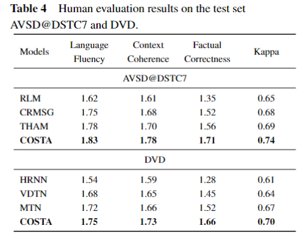
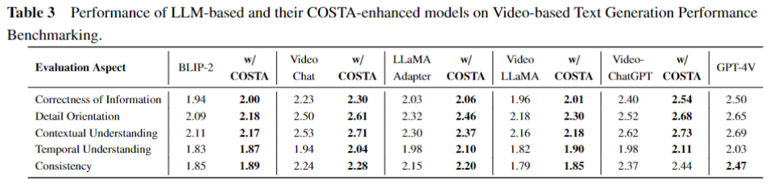

# Codes and Datas for Paper

**Cascade Context-oriented Spatio-temporal Attention Network for Efficient and Fine-grained Video-grounded Dialogues**




# Prerequisites
The project requires the following:

- PyTorch (version 1.9.0 or higher): The project was tested on PyTorch 1.10.0 with CUDA 11.1 support.
- Transformers (version 4.15.0 or higher): The project was tested on Transformers 4.15.0.
- Python packages: Additional Python packages specified in the requirements.txt file are necessary.

Install the package requirements:
`pip install -r requirements.txt`

# Data Preparation
You need to obtain necessary datasets and features.

## Audio-Visual Scene-Aware Dialog (AVSD) dataset
### Step 1: Download the original videos
You can download the original videos of AVSD (from Charades video dataset) for feature extraction from the below link:

[Charades videos](https://prior.allenai.org/projects/charades)

In our experiments, we place the downloaded videos into `data/Charades_videos` folder.

### Step 2: Extract video features from videos
You can extract the features on your own using the provided script located in the data directory:

`python data\extract_frame_feature.py`

This script extracts the patch features from video frames using Vision Transformer (ViT-B/16) from CLIP. Make sure the video are stored in `data/Charades_videos` folder. And the extracted video features will be stored in `data/Charades_ViT-B16` folder, with the format of `video_id.npy` files.

## DVD: a Diagnostic Dataset for Video-grounded Dialogues
Please refer to official repo to prepare video-grounded dialogues and original videos for feature extraction, as follows:

[DVD dataset](https://github.com/facebookresearch/DVDialogues)

# Training
With your environment set up and data ready, you can start training the model. To begin training, run the `train_COSTA.py` script located in the root directory.

`
python train_COSTA.py
`

You can also specify hyperparameters in the command line, as follows:

```
CUDA_VISIBLE_DEVICES=0 python train_COSTA.py --train_set=data/AVSD/train_set4DSTC7-AVSD.json \
        --valid_set=data/AVSD/valid_set4DSTC7-AVSD.json \
        --include_caption=caption \
        --model=out_models/COSTA/ \
        --v_fea_dir=data/Charades_ViT-B16/ \
        --nb_blocks=2 \
        --d_model=512 \
        --d_ff=2048 \
        --att_h=8 \
        --dropout=0.1 \
        --top_k=2 \
        --top_j=12 \
        --T=2 \
        --num_epochs=10 \
        --batch_size=32 \
        --max_length=64 \
        --max_history_length=5 \
        --report_interval=10 \
        --warmup_steps=9600 \
```

Make sure to modify the `train_set`, `valid_set`, `model` and `v_fea_dir` parameters in the command above to match the locations where you have stored the downloaded data and features. 

The trained model will be stored in `out_models/COSTA/` folder. 

# Evaluation
After completing model training, you can run the `test_COSTA.py` script to evaluate the performance of COSTA on the testset.

`
python test_COSTA.py
`

You can also specify hyperparameters in the command line, as follows:

```
CUDA_VISIBLE_DEVICES=0 test_COSTA.py --test_set=data/AVSD/test_set4DSTC7-AVSD.json \
        --model_conf=out_models/COSTA/.conf \
        --model=out_models/COSTA/_best \
        --maxlen=20 \
        --beam=5 \
        --penalty=1.0 \
        --nbest=5 \
        --output=out_models/COSTA/generated_results.json \
        --decode_style=beam_search \
        --undisclosed_only=1 \
        --labeled_test=data/AVSD/lbl_test_set4DSTC7-AVSD.json
        --v_fea_dir=data/Charades_ViT-B16-test/
```

Make sure to modify the `test_set`, `model_conf`, `model`, `output` and `labeled_test` parameters in the command above to match the locations where you have stored the trained model and the store location of the result.
 
After running the test script, you will obtain the evaluation result file, `out_models/COSTA/generated_results.json`. The scripts for evaluating results on standard metrics are in the folder `eval_metric/`, and please refer to `eval_metric/README.md` for evaluation.

# Comparision with LLM-based methods
Please refer to the released codes of LLM-based methods.

[Video-ChatGPT](https://github.com/mbzuai-oryx/Video-ChatGPT), [Video Chat](https://github.com/OpenGVLab/Ask-Anything), [Video-LLaMA](https://github.com/DAMO-NLP-SG/Video-LLaMA), [LLaMA Adapter](https://github.com/OpenGVLab/LLaMA-Adapter)

To enhance the performance of these LLM-based methods, please insert our Cascade Spatio-temporal Attention network (_Seg_Sele_ and _Reg_Sele_ class) and Memory Distillation-inspired Iterative Visual-textural Cross-attention (_ITAM_ class) into their original models. Then download their original video instruction tuning data to perform further video instruction tuning.


# Evaluation Results
- Evaluation results of baselines and COSTA on the test set of AVSD@DSTC7 and AVSD@DSTC8 benchmarks.



- Evaluation results on the test set of DVD.



- Evaluation results of human evaluation on the test set of AVSD@DSTC7.



- Performance of LLM-based and their COSTA-enhanced models on Video-based Text Generation Performance Benchmarking


